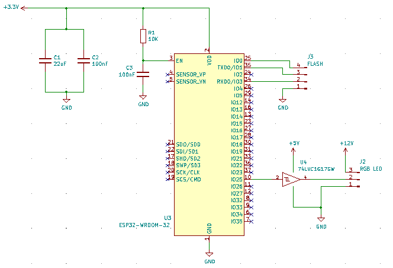

# **Controller circuit design**
Once the [power part](PowerSourceDesign.md) of the controller board was clarified, I am free to move to designing the rest of the controller.  
The controller itself is going to be simple (if not trivial) since all the magic is actually done by software.  

## Designing the brains of the operation
Not much of criteria for selecting the ESP chip **:-)**... I just wanted the cheapest ESP32 version that is dual core.  
I think the firmware will not need a lot of memory, so I don't need (I think) additional flash.  
So the one that I ended up choosing [**ESP32-WROOM-32E**](Hardware/Data%20Sheets/ESP32-WROOM-32E.pdf) model (2.5$ at [mouser.com](https://www.mouser.com/ProductDetail/espressif/esp32-wroom-32em113eh3200ph3q0/?qs=vHuUswq2%252bsx8Xcp7bzmaHA%3D%3D&countrycode=US&currencycode=USD)).  
  
I also need a level shifter so ESP32 (which 3.3V) can send data to the LEDs, which accept 5V data signal.
I have settled on using a **74LVC1G17**([**~$0.155](https://www.mouser.com/ProductDetail/Nexperia/74LVC1G17GW125?qs=sGAEpiMZZMutXGli8Ay4kDE4J8KCiPsFxNiM2xNKic4%3D)), [datasheet](Hardware/Data%20Sheets/74LVC1G17.pdf)  
  
I also need to [allow flashing](https://github.com/espressif/esptool/wiki/ESP32-Boot-Mode-Selection) the the the ESP wired as a recovery solution in case of any problem with the software. The simplest things that I could do was to expose RX(pin 34), TX (pin 23), GPIO0 (pin12) and ground on the board.  
To flash new firmware on the board I will connect the corresponding pins on the [**adapter**](https://www.amazon.com/gp/product/B081L482DP/ref=ppx_yo_dt_b_asin_title_o02_s00?ie=UTF8&psc=1):
* GND (pin 1 on ESP32) - GND on the adapter
* TX (pin 35 on ESP32) - RX on the adapter (*TX and RX must be cross connected for the communication to work*)
* RX (pin 34 on ESP32) - TX on the adapter
* GPIO0 (pin 25 on ESP) - short it to the GND (*ESP32 looks at this pin on boot to determine if it should accept new firmware or run the existing one*)
* leave the DTR and RTS not connected to anything  

With the connection set like above reset the board (cut the power and then connect it back). This would put the board in flashing mode and you can write your new firmware.  
***Note:** Since the ESP is only checking the GPIO0 at boot, I can also connect the adapter after the ESP32 finished booting up to see logging information produced during normal runnin.*

## Conclusion
Adding the ESP chip and the level shifter to the schematic the schema looks like this:  
  
***Note:** For convenience I have added links to the datasheets, source and price for all components in the KiCad project.*
