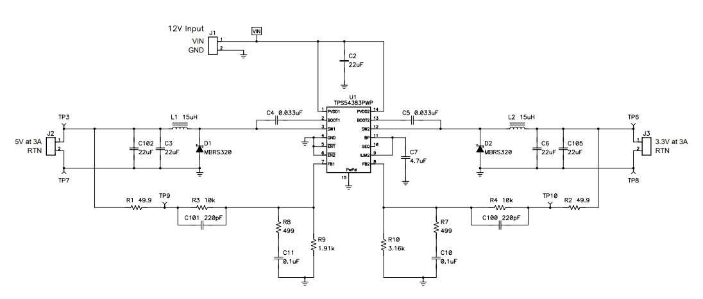
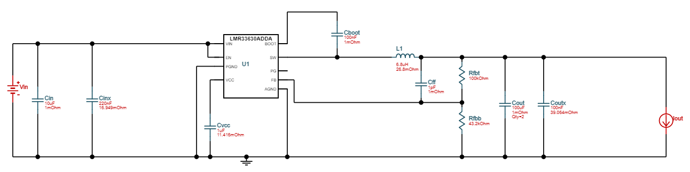
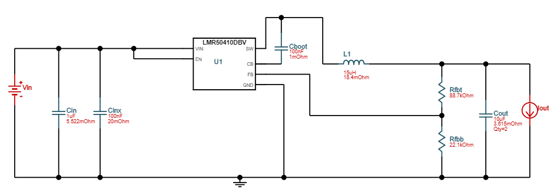
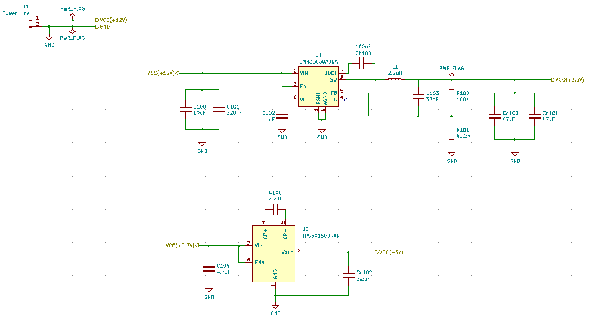

# **Light power source**
According to the original plan I burried 4 wires in the ground. When I decided to use ESPs for controlling the lights and have them communicate over WiFi, the two data lines remained unused.  
I am preserving them as backup:
- if any of the power lines is interrupted, I can use one ofthe old data lines to replace it
- if I find that there are too many lights on the power line and maybe the ones far at the end of the line are not lighting up bright enough (*not sure if this is a real posibility*), maybe I can use the backup lines to power some of the lights.  

# Power requirements
I'm using [LED modules](https://www.holidaycoro.com/ProductDetails.asp?ProductCode=654) (*~$1.7 each in 2020*) designed for use outside. Maybe a bit overengineered here (since they'll be inside a light enclosure), but since I don't know the enclosure watter proof rating, I thought I'd go with such modules to be extra safe.  
From what I could gather these modules have the following characteristics:
- they need 12V DC power
- they draw 47mA current when fully lit (white)
- the command (aka. data) line is 5V, and the protocol is WS2811 (*neopixel*)
- power drop for 100 modules (from 12V) 6.03V (*I think this only matters if you want to chain them, since I'm connecting the to power in parallel, I ignored this*)

So my light circuit will need to receive multiple voltages:  
- 12V to power the LED  
- 5V to power the level shifter for the data line of the light (since ESP has 3.3V outputs)  
- 3.3V to power the ESP controller  

I will use a power source that outputs 12V DC and it is capable of providing at least 3A to power all the lights and their controllers (meaning 36W).  
I found a reasonable [power source](https://www.holidaycoro.com/12-Volt-350-Watt-Power-Supply-p/49.htm) that can deliver 350W (*~$21 in 2020*).
So in each light I would need a dual output buck converter that gives me both 3.3V and 5V at the same time.

# Design
As far as I can tell there are three options for my situation:
1. A single converter that has two outputs (for the two voltages I need)
2. Or two separate buck converters from 12V to 3.3V and respectively 5V
3. Or a converter to 3.3V (since that is the main circuit) and just use a charge pump (booster) to generate 5V from the 3.3V rail

***Advice from a friend:** Stick to minimum of **0.65 mm** pitch (especially if placing parts manually). Given that I'll have to make about 40 of these, I would rather not pull my hair out when attempting to place the parts, so I have decided to follow his advice (at least for this project).*  

### **Option 1.**
I found these converters that have dual output, meet the pitch criteria and seem reasonably priced ([TPS54383*](https://www.mouser.com/Search/Refine?Keyword=TPS54383P&qty=42) ~ $2.15). They are a bit overspec as they can hadle 3A outputs, according to the [datasheet](https://www.ti.com/lit/ds/symlink/tps54383.pdf?ts=1601390106496&ref_url=https%253A%252F%252Fwww.ti.com%252Fproduct%252FTPS54383).  
The schematic in this case would look like this:  
  
*[**This**](https://www.ti.com/tool/PMP4961) link has some other information like the BOM and a suggested PCB design.*  

### **Option 2.**
Texas instruments has [a web tool](https://webench.ti.com/appinfo/webench/scripts/SDP.cgi?ID=5D04FE8ECF365618) that provides standard schematics, using their power converter chips, based on specific requirements.  
The schema is very similar with you you find in the [datasheet](Hardware/Data%20Sheets/LMR33630.pdf) of **LMR33630**. So I ended up blending this schema with the information in the datasheet.
The schematic for 3.3V in this case would look like this:  
  
And the characteristics of this circuit look like this:  
  
The going through the same process I picked a 5V buck converter.  
The schematic would look like this:  
  
And the characteristics of this circuit look like this:  
  
The original BOM (produced by the TI's tool) can be found [**here, for 5V**](Hardware/5BuckBOM.csv)  
The data sheet for this chip (**LMR50410**) can be found [**here**](https://www.ti.com/lit/ds/symlink/lmr50410.pdf?ts=1601747560668&ref_url=https%253A%252F%252Fwww.ti.com%252Fproduct%252FLMR50410).  

### **Option 3.**
Starting from the same circuit as **Option 2, for 3.3V**, add the charge pump to get to 5V for the level shifter chip.
A possible charge pump circuit is **TPS60150** ([data sheet](Hardware/Data%20Sheets/TPS60150.pdf)).  
The schema seems simple enough and with few components:  
  
This is cool because it does not use an inductor, which are tipically large components.  
It does have a low output current (only 140mA), so I need to make sure this is enough for the level shifter. 

## Conclusion
It looks like the most efficient schematic is Option 3 because it has fewer components in general, just one inductor (which are large components).  
This should work ok because the 5V part of the circuit is super simple (just the level shifter) and does not require a lot of current.  
Until I find some reason why this would not work, I am going to continue designing the rest of the circuit using this power source: *option 3*.  
I am uploading the [KiCad](https://kicad-pcb.org/download/) project with the whole schematic [here](Hardware/KiCad):  
  
I will keep updating the KiCad project as I fill in the rest of the components of this project.  
Next step is to add the [ESP and the level shifter](ESPCircuitDesign.md).  